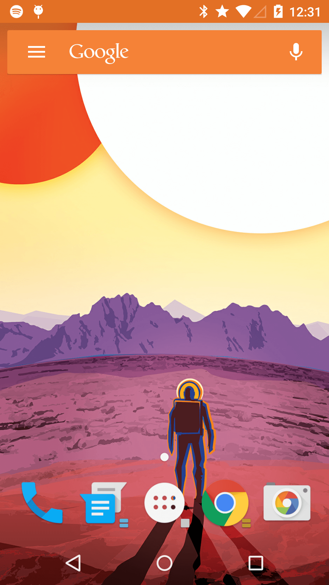

Simple Live Wallpaper Demo
==========================

A "Hello World" app that can be referened when creating a live wallpaper application for Android.

This app is just a barebones version of Roman Nurki's [Muzei][1] that cycles between a few images included in the APK. Do check out Muzei if you want something more advanced.

License
=======

    Copyright 2015 Chris Lacy
    Copyright 2014 Google Inc.

    Licensed under the Apache License, Version 2.0 (the "License");
    you may not use this file except in compliance with the License.
    You may obtain a copy of the License at

        http://www.apache.org/licenses/LICENSE-2.0

    Unless required by applicable law or agreed to in writing, software
    distributed under the License is distributed on an "AS IS" BASIS,
    WITHOUT WARRANTIES OR CONDITIONS OF ANY KIND, either express or implied.
    See the License for the specific language governing permissions and
    limitations under the License.

[1]: https://github.com/romannurik/muzei/